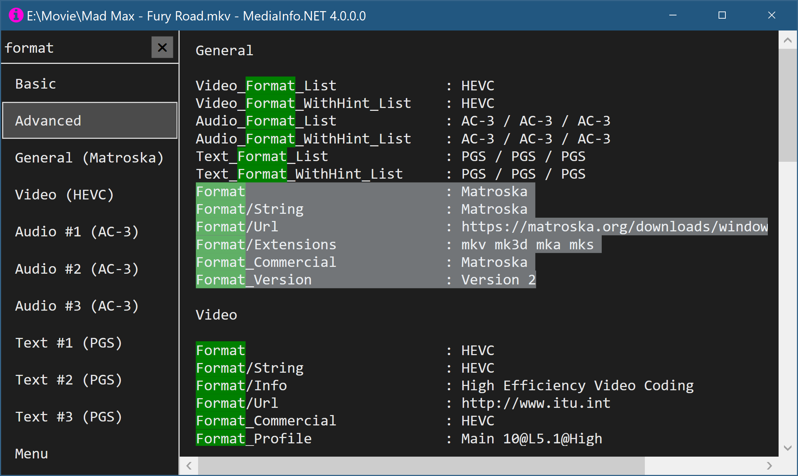

# MediaInfo.NET

MediaInfo.NET is a alternative MediaInfo frontend.

## Features

- High DPI support
- A search/filter feature
- A tab bar showing each track in a dedicated tab
- Move to the next and previous file of the folder
- Raw view to show parameters as used in the MediaInfo API

## Installation

Right-click to show the context menu and choose Install to register common file associations, File Explorer will then show a MediaInfo menu item in the context menu. For custom file extensions use [Open with++](https://github.com/stax76/OpenWithPlusPlus).

On a 32-Bit system download the DLL from the MediaInfo website, only the 64-Bit DLL is included.

## Usage

Open media files with the context menu in File Explorer or open files via drag & drop.

The search feature allows to quickly find properties.

F11/F12 navigates to the previous or next file in the folder.

The settings allow to change the font, font size, the window size and they allow to **enable raw view which shows developers the parameter names as they are used in the MediaInfo API**.