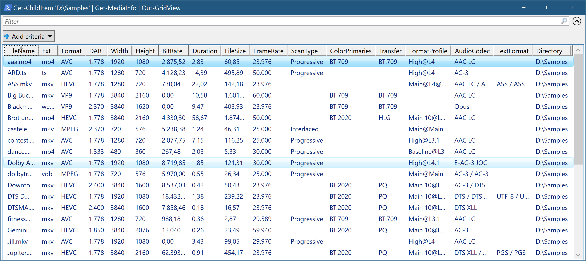

MediaInfo.NET
=============

MediaInfo.NET is a Windows application that shows media file information.

Features
--------

- High DPI support
- Search and highlight feature
- Tab bar showing each track in a dedicated tab
- Move to the next and previous file in the folder
- Raw view to show parameters as used in the MediaInfo API
- Customizable light and dark color theme
- Many settings to change the appearance
- Special presentation for encoding settings
- Compact summary
- Folder View powered by [Get-MediaInfo](https://github.com/stax76/Get-MediaInfo)
- Update check and PowerShell based update feature

Installation
------------

Run MediaInfo.NET and right-click to show the context menu, choose Install to register file associations, Windows File Explorer will then show a MediaInfo menu item in the context menu when a media file is right-clicked.

For power users there is [Open with++](https://github.com/stax76/OpenWithPlusPlus) for Windows File Explorer integration with icon support.

Usage
-----

Open media files with the context menu in Windows File Explorer or via drag & drop or via context menu.

The theme colors are not hard coded but defined in Settings.xml.

Developers can enable raw view to show the parameter names as they are used in the MediaInfo API.

MediaInfo.NET registers itself in the registry at:

`HKCU\Software\Microsoft\Windows\CurrentVersion\App Paths\`

This enables third party apps to find and start MediaInfo.NET.

Related Projects
----------------

**MediaInfo** is the library which MediaInfo.NET is based on.  
https://mediaarea.net/en/MediaInfo

**Get-MediaInfo** is a complete PowerShell MediaInfo solution.  
https://github.com/stax76/Get-MediaInfo

**StaxRip** is a video encoding GUI that integrates MediaInfo.NET.  
https://github.com/staxrip/staxrip

**mpv** and **mpv.net** are media players that allow to integrate MediaInfo.NET.  
https://mpv.io  
https://github.com/stax76/mpv.net

**Open with++** is a shell extension that can integrate MediaInfo.NET into Windows File Explorer with icon support.  
https://github.com/stax76/OpenWithPlusPlus
