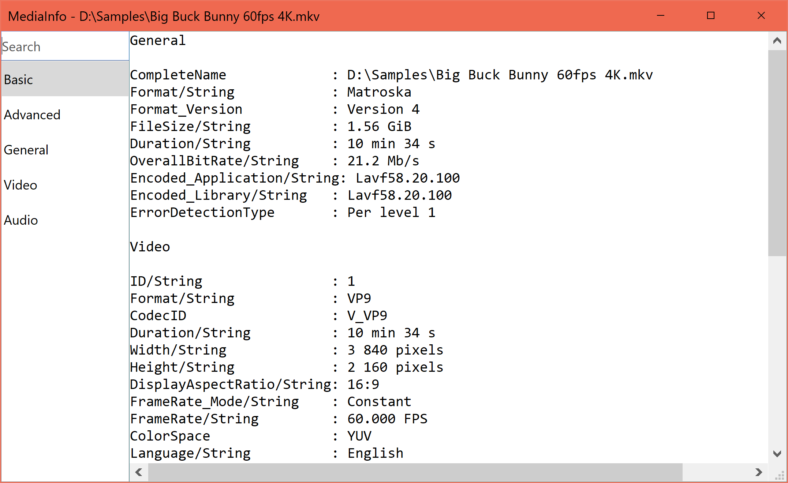
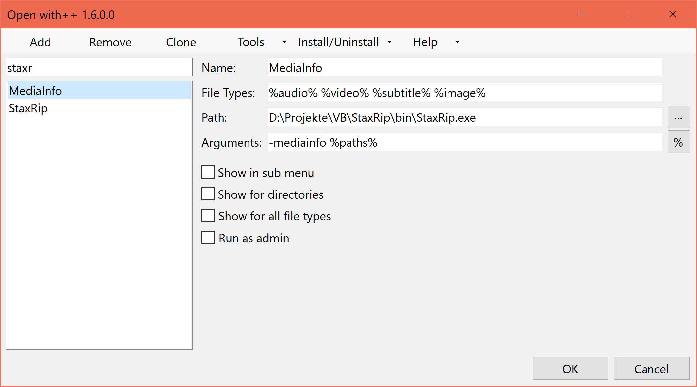

# MediaInfo.NET

MediaInfo.NET is a alternative MediaInfo frontend.

## Features

- High DPI support
- A search/filter feature
- A tab bar showing each track in a dedicated tab

Files can be opened via Drag & Drop and via command line:

`MediaInfoNET <input file>`

If you are a StaxRip user you can alternativly use StaxRip's MediaInfo frontend via:

`StaxRip -mediainfo <input file>`

StaxRip's MediaInfo frontend features a developer mode that shows the property names used for development instead of the user friendly property names.

At the moment there is no shell integration, it can be achieved with my shell extension [Open with++](https://github.com/stax76/OpenWithPlusPlus)

From my experience with my other projects I've learned that it takes years of hard work to make a project successful. I'm not sure if I'm willing to do that for this project. It might take a very long time before I add more features if ever, it depends if I get positive feedback on the application so click on the star button and leave a comment.

#### Features under consideration:

- Shell integration, possible options are file associations via setup or script or a shell extension
- Shortcut keys to navigate to the next and previous file
- Developer mode to show the development versions of the property names
- Remember the window size
- Your ideas?

## Screenshots

